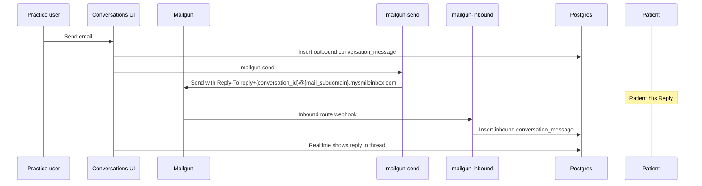

# Mailgun inbound email (patient replies in Conversations)

Outbound email from **Conversations** already uses `mailgun-send`. Patient **replies** need a Mailgun **inbound route** that posts to `mailgun-inbound`.

## How it works



1. **Outbound:** `mailgun-send` sets **From** `office@{mail_subdomain}.{root}` and **Reply-To** `reply+{conversation_id}@` the same practice host (see **`MAILGUN_PRACTICE_MAIL.md`**). Patient HTML includes a CAN-SPAM trust footer (practice name, address, phone).
2. **Inbound:** Mailgun receives the reply and POSTs to `mailgun-inbound`.
3. **Thread:** The function inserts an **inbound** `conversation_message` with `channel: email` (same triggers as SMS: auto-pause sequence, attribution, realtime).

## Deploy

```bash
npm run deploy:managed:functions
# or deploy only:
npx supabase functions deploy mailgun-inbound --no-verify-jwt --project-ref eymgqjeudrmeofytnwgs
```

## Secrets (Dashboard → Edge Functions)

| Secret | Required | Purpose |
|--------|----------|---------|
| `MAILGUN_PATIENT_MAIL_ROOT` | yes | e.g. `mail.heyhope.ai` |
| `MAILGUN_API_KEY` | yes | Outbound send |
| `MAILGUN_WEBHOOK_SIGNING_KEY` | recommended | Verify inbound webhook signature |
| `SUPABASE_URL` / `SUPABASE_SERVICE_ROLE_KEY` | auto | DB writes |

Find the signing key under **Mailgun → Settings → Webhooks** (HTTP webhook signing key).

## Mailgun route (one-time)

In [Mailgun](https://app.mailgun.com/) → **Sending** → **Domains** → your domain → **Routes**:

| Field | Value |
|-------|--------|
| Expression | `match_recipient("reply+.*@.*\\.mysmileinbox.com")` (subdomain Reply-To; see `MAILGUN_PATIENT_MAIL_ROOT`) |
| Action | `forward("https://eymgqjeudrmeofytnwgs.supabase.co/functions/v1/mailgun-inbound")` |
| Priority | `0` (or high priority) |

Legacy route (keep during transition for older root Reply-To addresses):

```
match_recipient("reply+.*@mysmileinbox.com")
```

Or run: `MAILGUN_API_KEY=... node scripts/setup-mailgun-inbound-route.mjs`

Optional catch-all for testing (lower priority):

```
match_recipient(".*@mg.heyhope.ai")
```

## App requirements

- **Settings → Messaging:** `email_enabled`, Mailgun secrets set; test email works.
- **Conversation:** `patient_email` on the conversation or linked consult (Conversations shows a warning if missing).
- Patient must use **Reply** on the CaseLift email (not compose to a different address).

## Fallback matching

If the patient replies to the **From** address instead of **Reply-To**, `mailgun-inbound` still tries to match `sender` to `conversations.patient_email` or `consults.patient_email` and create a thread if needed.

## Verify

1. Send an email from Conversations to a test inbox.
2. Reply from that inbox.
3. Within a few seconds the reply should appear in the thread (realtime subscription is already enabled).
